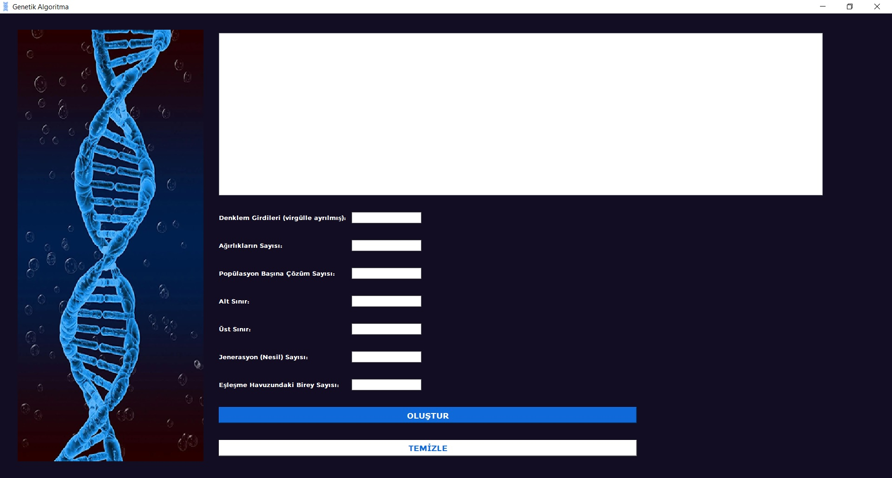
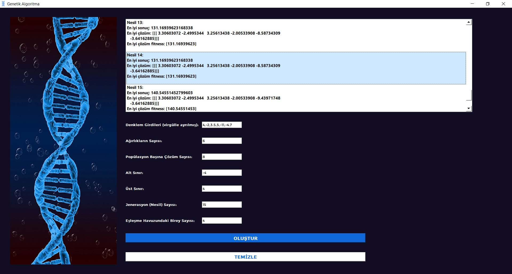

## Genetic Algorithm GUI
Bu proje, genetik algoritma kullanarak çözüm arama süreçlerini uygulamak için PyQt5 kütüphanesi kullanılarak Python dilinde geliştirilmiş bir GUI uygulamasını içerir.

## Genel Bakış
Genetik algoritmalar, biyolojik evrimden esinlenmiş optimizasyon algoritmalarıdır. Bu uygulama, genetik algoritmaların temel prensiplerini kullanarak çeşitli problemleri çözmek için bir araç sağlar. 

---

## İletişim
Eğer herhangi bir sorunuz, öneriniz veya geri bildiriminiz varsa, bana aşağıdaki kanallardan ulaşabilirsiniz:
- LinkedIn: [LinkedIn Profilim](https://www.linkedin.com/in/hsynkbulut/)
- Medium: [Medium Profilim](https://medium.com/@hsynkbulut)
- E-posta: [E-mail adresim](mailto:hsyn.kbulut@gmail.com)